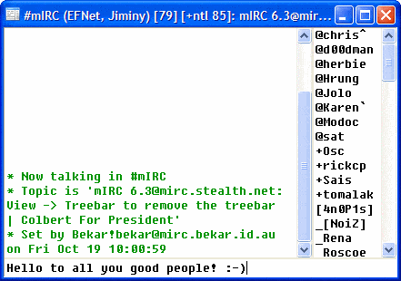
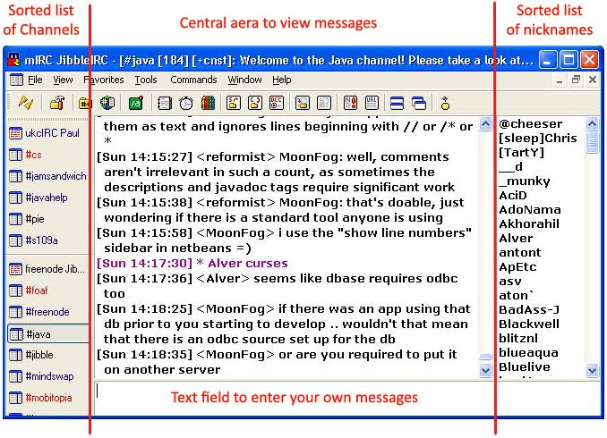

## IRC CHAT

+ This project aims to be similar to mIRC, which is IRC chat host

## Display

+ The display is separated in 3 parts, the available chats, the nicknames of users present in the chat and finally a text field to
send messages

## Mouse

+ The user will be able to click through different chats and scroll through the messages, maybe, when the message are hovered they change color.

## Keyboard

+ To type the message.

## RTC

+ The message will display the point in time which they were sent.

## Timer

+ When a chat has a new message it blinks on the screen.

## Serial Port

+ Responsible for the communication within the chat.